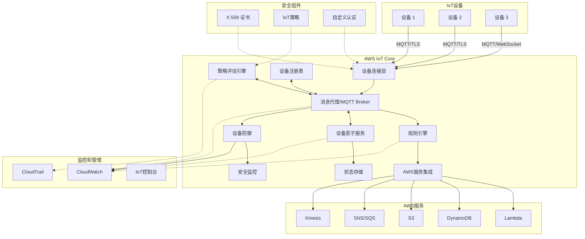
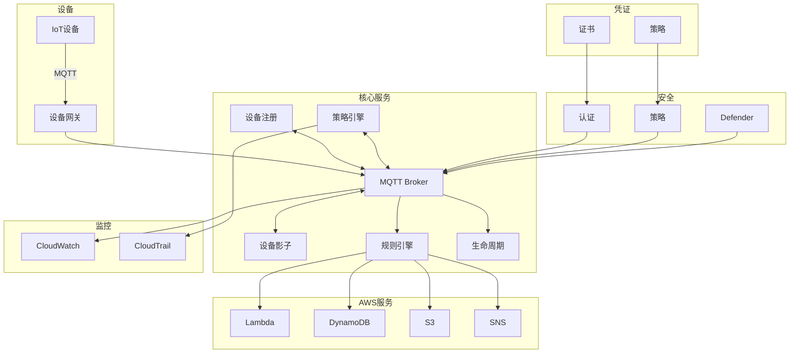
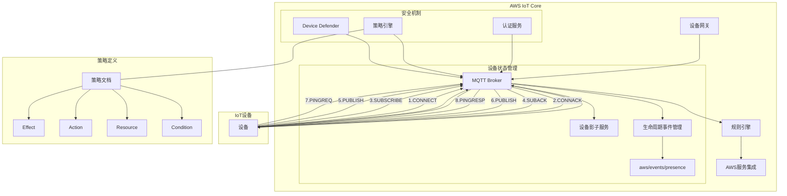
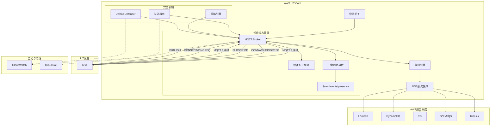

# AWS IoT Core是如何实现设备的保护机制？

展开来说，AWS iot core如何做心跳监控到设备的状态？ 因为AWS iot core用的是 mqtt 是否能实现长链接的方式，如何去实现类似socket长链接的功能？

那么AWS iot core如何策略？ iot core的底层实现是啥？


# 一、Think:  这个问题涉及到 AWS IoT Core 的几个核心机制：设备保护机制、设备状态监控（心跳）、长连接实现、策略管理以及底层架构。我将逐一解析这些机制，并在最后提供一个 Mermaid 架构图来帮助理解。

## AWS IoT Core 的设备保护机制

AWS IoT Core 提供多层次的设备保护机制：

1. **认证与授权**：
   - X.509 证书认证：设备使用 X.509 证书进行身份验证
   - AWS SigV4 签名：通过AWS凭证进行认证
   - 自定义授权器：支持自定义的认证逻辑
   - Amazon Cognito 身份：用于Web和移动应用认证

2. **传输层安全**：
   - TLS/SSL 加密：所有通信通道都使用 TLS 1.2 或更高版本加密
   - 支持多种密码套件：确保通信安全

3. **设备策略**：
   - IoT 策略：类似于 IAM 策略，控制设备可以执行的操作
   - 细粒度权限控制：可以精确控制设备对主题、影子状态等的访问权限

4. **设备防御**：
   - 设备风险评分：AWS IoT Device Defender 会监控设备行为并分配风险分数
   - 异常检测：识别异常的连接模式或消息模式
   - 违规行为检测：检测设备是否违反了预设的安全规则

5. **审计与监控**：
   - 持续安全审计：检查IoT配置是否符合安全最佳实践
   - 实时监控：监控设备行为和通信模式
   - CloudWatch 集成：记录和分析设备活动日志

## AWS IoT Core 的心跳监控与设备状态

AWS IoT Core 使用 MQTT 协议的特性来监控设备状态：

1. **MQTT Keep-Alive 机制**：
   - MQTT 协议本身支持 Keep-Alive 机制，客户端在 CONNECT 消息中设置 Keep-Alive 时间间隔
   - 如果在这个时间间隔内没有消息交换，客户端会发送 PINGREQ 消息，服务器回复 PINGRESP
   - 如果服务器在 1.5 × Keep-Alive 时间内没有收到客户端的任何消息，会认为连接已断开

2. **设备生命周期事件**：
   - AWS IoT Core 提供内置的生命周期事件
   - 当设备连接到 AWS IoT Core 时，会发布一个 `$aws/events/presence/connected/clientId` 消息
   - 当设备断开连接时，会发布一个 `$aws/events/presence/disconnected/clientId` 消息
   - 其他服务或应用可以订阅这些事件来跟踪设备的连接状态

3. **设备影子服务**：
   - 提供持久性设备状态存储
   - 即使设备离线，其他服务也可以查询和更新设备的预期状态
   - 设备重新连接后，可以同步最新状态
   - 影子文档包含`reported`（设备报告的当前状态）和`desired`（希望设备达到的状态）两部分

4. **Fleet索引**：
   - 可以索引、搜索和聚合设备数据
   - 支持设备连接状态的查询
   - 可以基于设备状态创建动态设备组

## AWS IoT Core 的长连接实现

AWS IoT Core 基于 MQTT 协议，天然支持长连接：

1. **MQTT 协议特性**：
   - MQTT 是为资源受限的设备和不可靠网络设计的轻量级协议
   - 采用发布/订阅模式，支持QoS（服务质量）级别
   - 内置会话管理，支持持久连接和消息队列

2. **连接方式**：
   - 使用标准 MQTT（端口8883，TLS加密）
   - 使用 MQTT over WebSockets（端口443，适用于有防火墙限制的环境）
   - 支持HTTP REST API（用于不需要长连接的场景）

3. **长连接维护**：
   - 服务端保持TCP连接开放，直到客户端断开或Keep-Alive超时
   - AWS IoT Core 支持大规模并发长连接
   - 自动负载均衡，确保高可用性

4. **断线重连机制**：
   - 客户端可以使用 MQTT 的 Clean Session 标志来保持会话状态
   - 重连时可以恢复之前的订阅和未送达的消息
   - AWS IoT SDK 提供内置的重连逻辑，包括指数退避策略

5. **长连接优化**：
   - 可配置的Keep-Alive间隔，以平衡响应性和网络开销
   - 支持 MQTT 5.0 的新特性（如属性、共享订阅等）
   - 提供连接限流和消息限流功能，防止过载

## AWS IoT Core 的策略实现

AWS IoT Core 的策略系统类似于 IAM 策略，但专为 IoT 设备设计：

1. **策略结构**：
   - JSON 格式，包含一系列语句（Statement）
   - 每个语句指定 Effect（Allow/Deny）、Action、Resource 和可选的 Condition
   - 支持通配符和变量，如 `${iot:ClientId}` 可引用连接的客户端 ID

2. **策略评估**：
   - 默认拒绝所有操作，除非明确允许
   - 如果有明确的 Deny，将覆盖任何 Allow
   - 评估所有适用的策略，组合结果决定最终权限

3. **策略动作**：
   - MQTT相关：`iot:Connect`, `iot:Subscribe`, `iot:Receive`, `iot:Publish`
   - 设备影子相关：`iot:GetThingShadow`, `iot:UpdateThingShadow`, `iot:DeleteThingShadow`
   - 设备注册表相关：`iot:DescribeThing`, `iot:UpdateThing` 等

4. **资源指定**：
   - 使用ARN（Amazon Resource Name）格式
   - 例如：`arn:aws:iot:region:account-id:topic/my/topic`
   - 支持主题过滤器，如 `topic/+/subtopic/#`

5. **策略附加**：
   - 策略可以附加到X.509证书
   - 策略可以附加到Cognito身份
   - 一个证书或身份可以附加多个策略
   - 支持策略变量，根据连接属性动态评估权限

## AWS IoT Core 的底层实现

AWS IoT Core 的底层架构包含多个组件：

1. **消息代理（Message Broker）**：
   - 实现MQTT协议的核心组件
   - 处理设备连接、认证和消息路由
   - 支持QoS 0和QoS 1消息传递
   - 可扩展设计，支持数十亿设备和消息

2. **设备影子（Device Shadow）服务**：
   - 维护设备状态的JSON文档
   - 提供REST API和MQTT接口
   - 跟踪版本变化，支持乐观并发控制
   - 存储在高可用性数据库中

3. **规则引擎（Rules Engine）**：
   - 使用类SQL语法定义规则
   - 处理MQTT消息并触发动作
   - 与其他AWS服务集成（如Lambda, DynamoDB, S3等）
   - 支持消息转换和条件处理

4. **设备注册表（Registry）**：
   - 存储设备元数据
   - 管理设备组和类型
   - 提供设备索引和搜索功能
   - 与IAM和策略系统集成

5. **安全组件**：
   - 证书管理服务：处理X.509证书的创建、存储和撤销
   - 自定义认证器：支持第三方认证服务集成
   - 策略评估引擎：处理授权决策
   - 集成AWS KMS用于密钥管理

6. **安全审计与监控**：
   - Device Defender：监控设备安全合规性
   - CloudWatch：收集和处理日志和指标
   - CloudTrail：记录API调用和管理事件

7. **数据处理管道**：
   - 基于云原生、微服务架构
   - 使用AWS的底层基础设施服务（如ECS, Lambda, Kinesis等）
   - 高可用性设计，跨可用区部署
   - 自动扩缩容，适应流量变化

现在，让我为这些内容设计一个Mermaid架构图，以便于理解AWS IoT Core的整体架构和各组件之间的关系。

Mermaid架构图代码：



这个架构图展示了AWS IoT Core的主要组件和它们之间的关系。还可以对图进行进一步完善，增加更多细节，比如设备状态监控的流程、长连接的维护机制、策略评估过程等。我可以根据需要调整和扩展这个架构图。

现在让我基于上面的内容编写一个完整的回答，包括设备保护机制、心跳监控、长连接实现、策略管理以及底层架构的详细解释，并附上Mermaid架构图。

让我调整一下架构图，使其更加清晰，同时增加一些关于设备监控和状态管理的细节：



这个版本的架构图增加了更多关于MQTT连接细节的展示，包括Keep-Alive机制和设备生命周期事件，更好地说明了AWS IoT Core如何监控设备状态。但是我觉得这个图可能还是有点复杂，让我再做一个简化版的，更关注问题中提到的核心点：设备保护、心跳监控、长连接和策略实现。



这个更加简化的版本主要关注MQTT长连接实现、设备状态监控和策略定义，更符合问题的重点。我可以基于这个架构图来详细解释每个部分的工作原理。


# AWS IoT Core 设备保护与连接机制详解

## 1. AWS IoT Core 设备保护机制

AWS IoT Core 实现了多层次的设备保护机制，确保设备通信的安全性和可靠性：

### 认证与授权
- **X.509 证书认证**：每个设备使用唯一的X.509证书进行身份验证
- **策略控制**：IoT策略定义设备可执行的操作权限
- **传输层安全**：所有通信都通过TLS 1.2+加密

### 设备监控与防护
- **Device Defender**：持续监控设备行为，检测异常
- **风险评分**：自动为设备行为分配风险等级
- **违规通知**：发现安全问题时自动触发告警

## 2. 设备心跳监控与状态管理

AWS IoT Core 通过MQTT协议的特性实现设备状态监控：

### MQTT Keep-Alive 机制
- 设备连接时设定Keep-Alive时间间隔（如120秒）
- 无消息交换时，设备发送PINGREQ，服务端回复PINGRESP
- 超过1.5倍Keep-Alive时间无响应，判定连接断开

### 生命周期事件
- 设备连接时自动发布消息：`$aws/events/presence/connected/clientId`
- 设备断开时自动发布消息：`$aws/events/presence/disconnected/clientId`
- 应用可订阅这些主题实时监控设备状态

### 设备影子
- 存储设备最新状态，包括离线设备
- 提供"reported"和"desired"状态同步机制
- 设备重连后自动同步最新状态

## 3. 长连接实现

AWS IoT Core 基于MQTT协议，天然支持长连接：

### MQTT长连接特性
- 保持TCP连接不断开，减少重连开销
- 支持QoS确保消息可靠传递
- 低带宽消耗，适合资源受限设备

### 连接管理
- 自动连接恢复和指数退避重试
- 会话持久性，离线消息缓存
- 支持WebSocket上的MQTT连接，兼容复杂网络环境

## 4. IoT Core 策略实现

AWS IoT策略使用JSON格式定义，控制设备的访问权限：

### 策略结构
```json
{
  "Version": "2012-10-17",
  "Statement": [
    {
      "Effect": "Allow",
      "Action": "iot:Connect",
      "Resource": "arn:aws:iot:region:account:client/${iot:ClientId}"
    },
    {
      "Effect": "Allow",
      "Action": "iot:Publish",
      "Resource": "arn:aws:iot:region:account:topic/device/${iot:ClientId}/data"
    }
  ]
}
```

### 策略评估
- 默认拒绝所有，除非明确允许
- 策略可附加到证书或身份
- 支持变量和条件表达式，实现动态权限控制

## 5. IoT Core 底层架构

AWS IoT Core的底层实现包括多个专用组件，协同工作实现高可扩展性和可靠性：

- **消息代理**：高性能MQTT Broker，处理设备连接和消息路由
- **规则引擎**：使用类SQL语法处理消息并触发动作
- **设备影子服务**：管理设备状态的持久存储
- **设备注册表**：维护设备元数据和组织结构
- **安全组件**：处理认证、授权和策略评估

## 架构图



通过这种架构，AWS IoT Core能够同时支持数百万设备的安全连接、状态监控和消息处理，为IoT应用提供可靠的云端基础设施。设备与AWS IoT Core之间的MQTT长连接保证了实时通信能力，而完善的安全机制则确保了整个系统的安全性。


# 二、创建一个专属的Mermaid流程图，专门说明设备心跳监控与状态管理，以及长连接实现。

**我将把这些功能整合到一个完整的流程图中，清晰地展示MQTT Keep-Alive机制、生命周期事件、设备影子和长连接实现的工作流程。**

> Think: 
> 根据请求，我需要创建一个专属的Mermaid流程图，专门说明设备心跳监控与状态管理，以及长连接实现。我将把这些功能整合到一个完整的流程图中，清晰地展示MQTT Keep-Alive机制、生命周期事件、设备影子和长连接实现的工作流程。
> 
> 我将设计一个流程图，展示以下主要元素：
> 1. 设备与AWS IoT Core的连接过程
> 2. Keep-Alive心跳机制的工作方式
> 3. 设备生命周期事件的触发和处理
> 4. 设备影子的状态同步机制
> 5. 长连接的维护和恢复机制
> 
> 让我设计这个Mermaid流程图：
> 
> ```mermaid
> flowchart TD
>     subgraph "设备" 
>         Device[IoT设备]
>     end
>     
>     subgraph "AWS IoT Core"
>         MQTT[MQTT Broker]
>         Shadow[设备影子服务]
>         Events[生命周期事件管理]
>         Registry[设备注册表]
>     end
>     
>     subgraph "应用"
>         App[监控应用]
>     end
>     
>     %% 连接建立
>     Device -->|1. CONNECT\n设置Keep-Alive=120s| MQTT
>     MQTT -->|2. CONNACK| Device
>     
>     %% 生命周期事件 - 连接
>     MQTT -->|3. 发布连接事件| Events
>     Events -->|4. $aws/events/presence/connected/clientId| App
>     
>     %% 状态同步
>     Device -->|5. SUBSCRIBE\n设备影子主题| MQTT
>     MQTT -->|6. SUBACK| Device
>     
>     %% 初始同步
>     MQTT -->|7. 获取当前影子状态| Shadow
>     Shadow -->|8. 返回当前状态| MQTT
>     MQTT -->|9. 发送影子文档| Device
>     
>     %% 状态报告和更新
>     Device -->|10. PUBLISH\n上报设备状态| MQTT
>     MQTT -->|11. 更新reported状态| Shadow
>     App -->|12. 更新desired状态| Shadow
>     Shadow -->|13. 发布状态变更| MQTT
>     MQTT -->|14. 通知设备| Device
>     
>     %% Keep-Alive机制
>     Device -->|15. PINGREQ\n(120s内无消息时)| MQTT
>     MQTT -->|16. PINGRESP| Device
>     
>     %% 断线场景
>     Device -->|17. 设备离线\n(超过180s无响应)| MQTT
>     MQTT -->|18. 检测连接断开| Events
>     Events -->|19. $aws/events/presence/disconnected/clientId| App
>     
>     %% 离线期间的状态更改
>     App -->|20. 更新desired状态| Shadow
>     Shadow -->|21. 保存期望状态| Shadow
>     
>     %% 重连过程
>     Device -->|22. 重连 CONNECT| MQTT
>     MQTT -->|23. CONNACK| Device
>     Events -->|24. 发布重连事件| App
>     
>     %% 状态同步
>     MQTT -->|25. 发送累积的影子更新| Device
>     Device -->|26. 应用状态变更并上报| MQTT
>     
>     %% 连接管理
>     Device -.->|自动重连\n指数退避| MQTT
>     MQTT -.->|会话持久性\n(QoS>0消息保留)| Device
>     
>     %% 样式设置
>     classDef device fill:#f9d4d4,stroke:#d83737,stroke-width:2px
>     classDef aws fill:#e9f6fb,stroke:#0e7cb3,stroke-width:2px
>     classDef app fill:#e1f5e1,stroke:#399e39,stroke-width:2px
>     
>     class Device device
>     class MQTT,Shadow,Events,Registry aws
>     class App app
> ```
> 
> 我觉得这个图有点复杂了，可能不够清晰。让我重新设计一个更简洁的版本，更集中地展示心跳监控与长连接机制：
> 
> ```mermaid
> flowchart TD
>     %% 节点定义
>     Device[IoT设备]
>     MQTT[AWS IoT MQTT Broker]
>     Shadow[设备影子服务]
>     Events[生命周期事件]
>     App[应用/服务]
>     
>     %% 连接建立
>     Device -->|1. CONNECT\nKeep-Alive=120s| MQTT
>     MQTT -->|2. CONNACK| Device
>     
>     %% 生命周期事件 - 连接
>     MQTT -->|3. 发布连接事件| Events
>     Events -->|"4. $aws/events/presence/connected/clientId"| App
>     
>     %% 设备影子同步
>     Device -->|5. 上报状态\n(reported)| Shadow
>     App -->|6. 设置期望状态\n(desired)| Shadow
>     Shadow -->|7. 通知状态变更| Device
>     
>     %% Keep-Alive机制
>     Device -->|8. PINGREQ\n(120s无通信时)| MQTT
>     MQTT -->|9. PINGRESP| Device
>     
>     %% 断线检测
>     MQTT -->|10. 检测断线\n(>180s无响应)| Events
>     Events -->|"11. $aws/events/presence/disconnected/clientId"| App
>     
>     %% 断线期间
>     App -->|12. 更新desired状态| Shadow
>     Shadow -->|13. 存储状态变更| Shadow
>     
>     %% 重连过程
>     Device -->|14. 重连\n(指数退避重试)| MQTT
>     MQTT -->|15. CONNACK\nSession Present=1| Device
>     
>     %% 重连后同步
>     Shadow -->|16. 同步累积的状态变更| Device
>     Device -->|17. 应用变更并确认| Shadow
>     
>     %% 样式设置
>     classDef device fill:#f9d4d4,stroke:#d83737,stroke-width:2px
>     classDef aws fill:#e9f6fb,stroke:#0e7cb3,stroke-width:2px
>     classDef app fill:#e1f5e1,stroke:#399e39,stroke-width:2px
>     
>     class Device device
>     class MQTT,Shadow,Events aws
>     class App app
> ```
> 
> 再次检查，我发现这个图仍然有些复杂。为了更好地展示流程，我将把它分成两个部分：一个展示心跳监控与状态管理，另一个展示长连接实现。
> 
> 先做心跳监控与状态管理的流程图：
> 
> ```mermaid
> sequenceDiagram
>     participant Device as IoT设备
>     participant MQTT as AWS IoT MQTT Broker
>     participant Shadow as 设备影子服务
>     participant Events as 生命周期事件
>     participant App as 应用/服务
>     
>     %% 连接建立
>     Device->>MQTT: CONNECT (Keep-Alive=120s)
>     MQTT-->>Device: CONNACK
>     
>     %% 生命周期事件 - 连接
>     MQTT->>Events: 触发连接事件
>     Events->>App: 发布 $aws/events/presence/connected/clientId
>     
>     %% 设备影子同步
>     Device->>MQTT: PUBLISH (上报状态到设备影子)
>     MQTT->>Shadow: 更新reported状态
>     App->>Shadow: 更新desired状态
>     Shadow->>MQTT: 发布状态变更通知
>     MQTT-->>Device: 接收状态变更
>     Device->>MQTT: 确认并更新状态
>     
>     %% Keep-Alive机制
>     Note over Device,MQTT: 120秒内无通信
>     Device->>MQTT: PINGREQ
>     MQTT-->>Device: PINGRESP
>     
>     %% 断线场景
>     Note over Device,MQTT: 设备意外断线
>     Note over MQTT,Events: 超过180秒无响应
>     MQTT->>Events: 检测连接断开
>     Events->>App: 发布 $aws/events/presence/disconnected/clientId
>     
>     %% 离线期间的状态更改
>     App->>Shadow: 继续更新desired状态
>     Shadow->>Shadow: 存储离线期间的状态变更
>     
>     %% 设备重连
>     Device->>MQTT: 重新CONNECT
>     MQTT-->>Device: CONNACK (Session Present=1)
>     MQTT->>Events: 触发重连事件
>     Events->>App: 发布连接事件
>     
>     %% 状态同步
>     Shadow->>MQTT: 发送累积的状态变更
>     MQTT-->>Device: 接收离线期间的状态更新
>     Device->>MQTT: 确认并更新本地状态
> ```
> 
> 接下来设计长连接实现的流程图：
> 
> ```mermaid
> sequenceDiagram
>     participant Device as IoT设备
>     participant MQTT as AWS IoT MQTT Broker
>     
>     %% 初始连接
>     Device->>MQTT: CONNECT (Clean Session=0, Keep-Alive=120s)
>     Note right of Device: 设置Clean Session=0<br/>请求保持会话状态
>     MQTT-->>Device: CONNACK (Session Present=0)
>     Note left of MQTT: 首次连接，无现有会话
>     
>     %% 订阅主题
>     Device->>MQTT: SUBSCRIBE (QoS=1)
>     MQTT-->>Device: SUBACK
>     
>     %% 正常操作 - 长时间保持连接
>     Note over Device,MQTT: 长连接保持活跃
>     Device->>MQTT: PUBLISH (QoS=1)
>     MQTT-->>Device: PUBACK
>     MQTT->>Device: PUBLISH (下行消息, QoS=1)
>     Device-->>MQTT: PUBACK
>     
>     %% Keep-Alive心跳
>     Note over Device,MQTT: 120秒内无通信
>     Device->>MQTT: PINGREQ
>     MQTT-->>Device: PINGRESP
>     
>     %% 网络中断
>     Note over Device,MQTT: 网络中断
>     
>     %% 服务端对断线的处理
>     Note over MQTT: 超过180秒(1.5×Keep-Alive)无响应
>     Note over MQTT: 标记连接断开但保持会话状态
>     
>     %% 服务端缓存消息
>     Note over MQTT: 为断线设备缓存QoS>0的消息
>     
>     %% 设备重连
>     Note over Device: 检测到断线，启动重连
>     Note over Device: 使用指数退避策略
>     Note over Device: (1s, 2s, 4s, 8s, 16s, ...)
>     Device->>MQTT: CONNECT (Clean Session=0, Keep-Alive=120s)
>     MQTT-->>Device: CONNACK (Session Present=1)
>     Note left of MQTT: 恢复现有会话
>     
>     %% 恢复会话状态
>     Note over MQTT: 不需要重新订阅
>     MQTT->>Device: 发送缓存的QoS>0消息
>     Device-->>MQTT: PUBACK
> 
>     %% 恢复正常操作
>     Note over Device,MQTT: 长连接恢复正常
> ```
> 
> 我觉得用顺序图(sequenceDiagram)比流程图(flowchart)更适合表达这种交互，但是原始需求要求用流程图。让我重新尝试用flowchart设计，但这次将关注点分开，一个图展示心跳监控与状态管理，一个图展示长连接实现：
> 
> 设备心跳监控与状态管理流程图：
> 
> ```mermaid
> flowchart TD
>     %% 主要组件
>     Device[IoT设备]
>     MQTT[AWS IoT MQTT Broker]
>     Shadow[设备影子服务]
>     Events[生命周期事件]
>     App[应用/服务]
>     
>     %% 设备连接
>     Device -->|1. CONNECT\nKeep-Alive=120s| MQTT
>     MQTT -->|2. CONNACK| Device
>     MQTT -->|3. 触发连接事件| Events
>     Events -->|4. 发布连接通知| App
>     
>     %% Keep-Alive机制
>     Active{活跃通信?}
>     Device -->|5. 120s计时器| Active
>     Active -->|是| Active
>     Active -->|否| PingReq[发送PINGREQ]
>     PingReq --> MQTT
>     MQTT -->|6. PINGRESP| Device
>     
>     %% 设备状态同步
>     Device -->|7. PUBLISH\n上报当前状态| MQTT
>     MQTT -->|8. 更新| Shadow
>     App -->|9. 更新desired状态| Shadow
>     Shadow -->|10. 发布状态Delta| MQTT
>     MQTT -->|11. 推送状态变更| Device
>     
>     %% 断线检测
>     MQTT -->|12. 超过180s\n无心跳| Offline[标记设备离线]
>     Offline --> Events
>     Events -->|13. 发布断线通知| App
>     
>     %% 离线设备状态
>     App -->|14. 继续更新\ndesired状态| Shadow
>     Shadow -->|15. 存储状态变更| Shadow
>     
>     %% 设备重连
>     Device -->|16. 重连\nCONNECT| MQTT
>     MQTT -->|17. CONNACK| Device
>     MQTT -->|18. 触发重连事件| Events
>     Events -->|19. 发布重连通知| App
>     
>     %% 重连后同步
>     Shadow -->|20. 发送累积的\n状态变更| MQTT
>     MQTT -->|21. 推送状态更新| Device
>     Device -->|22. 同步本地状态| Device
>     
>     %% 样式设置
>     classDef device fill:#f9d4d4,stroke:#d83737,stroke-width:2px
>     classDef aws fill:#e9f6fb,stroke:#0e7cb3,stroke-width:2px
>     classDef app fill:#e1f5e1,stroke:#399e39,stroke-width:2px
>     classDef process fill:#f5f5f5,stroke:#333333,stroke-width:1px
>     
>     class Device device
>     class MQTT,Shadow,Events aws
>     class App app
>     class Active,PingReq,Offline process
> ```
> 
> 长连接实现流程图：
> 
> ```mermaid
> flowchart TD
>     %% 主要状态
>     Start[开始] --> ConnAttempt[连接尝试]
>     
>     %% 连接处理
>     ConnAttempt -->|CONNECT\nClean Session=0\nKeep-Alive=120s| Broker[AWS IoT MQTT Broker]
>     Broker -->|CONNACK| Connected{连接成功?}
>     
>     %% 连接失败处理
>     Connected -->|否| Backoff[指数退避]
>     Backoff -->|延迟后重试\n1s,2s,4s,8s...| ConnAttempt
>     
>     %% 连接成功处理
>     Connected -->|是| SessionCheck{有现有会话?}
>     SessionCheck -->|是\nSession Present=1| Restore[恢复会话状态]
>     SessionCheck -->|否\nSession Present=0| Subscribe[订阅所需主题]
>     
>     Restore --> Normal[正常操作]
>     Subscribe --> Normal
>     
>     %% 正常操作状态
>     Normal --> Activity{有活动?}
>     Activity -->|有消息交换| Normal
>     Activity -->|无消息120s| Ping[发送PINGREQ]
>     
>     Ping --> PingResp{收到PINGRESP?}
>     PingResp -->|是| Normal
>     PingResp -->|否| ConnCheck[检查连接]
>     
>     %% 连接检查
>     ConnCheck --> Connected2{连接正常?}
>     Connected2 -->|是| Normal
>     Connected2 -->|否| ConnLost[连接丢失]
>     
>     %% 连接丢失处理
>     ConnLost --> ReconnStrategy[重连策略]
>     ReconnStrategy -->|清理本地资源| Backoff
>     
>     %% 离线消息处理
>     Broker -->|存储QoS>0消息| MsgStore[离线消息存储]
>     
>     %% 重连成功后
>     Restore -->|接收缓存消息| MsgSync[同步离线消息]
>     MsgSync --> Normal
>     
>     %% 样式设置
>     classDef start fill:#f9d4d4,stroke:#d83737,stroke-width:2px
>     classDef broker fill:#e9f6fb,stroke:#0e7cb3,stroke-width:2px
>     classDef state fill:#f5f5f5,stroke:#333333,stroke-width:1px
>     classDef decision fill:#f5f0e6,stroke:#d4a86c,stroke-width:1px
>     
>     class Start,ConnAttempt,ConnLost,Backoff start
>     class Broker,MsgStore broker
>     class Normal,Ping,Restore,Subscribe,MsgSync state
>     class Connected,SessionCheck,Activity,PingResp,Connected2 decision
> ```
> 
> 结合上面的思考，我将提供两个流程图：一个展示设备心跳监控与状态管理，另一个展示长连接实现。这样可以更清晰地展示这两个关键功能。
> 
> 不过我注意到，请求是想要一个流程图涵盖全部内容。我将尝试合并这些内容到一个更完整但清晰的流程图中：
> 
> ```mermaid
> flowchart TD
>     %% 设备和AWS IoT Core组件
>     Device[IoT设备]
>     MQTT[AWS IoT MQTT Broker]
>     Shadow[设备影子服务]
>     Events[生命周期事件]
>     App[应用/服务]
>     
>     %% 初始连接过程
>     Start[开始] --> ConnReq[连接请求]
>     ConnReq -->|1. CONNECT\nKeep-Alive=120s\nClean Session=0| MQTT
>     MQTT -->|2. CONNACK| Device
>     
>     %% 生命周期事件 - 设备上线
>     MQTT -->|3. 触发设备上线事件| Events
>     Events -->|"4. 发布到$aws/events/\npresence/connected/clientId"| App
>     
>     %% 会话状态检查
>     MQTT -->|5. 会话检查| SessionCheck{有现有会话?}
>     SessionCheck -->|否\nSession Present=0| SubReq[订阅请求]
>     SessionCheck -->|是\nSession Present=1| SyncState[同步会话状态]
>     
>     SubReq -->|6. SUBSCRIBE| MQTT
>     MQTT -->|7. SUBACK| SubReq
>     
>     SyncState -->|接收之前的QoS>0消息| Device
>     
>     %% 设备影子状态同步
>     Device -->|8. 发布当前状态\n到设备影子| MQTT
>     MQTT -->|9. 更新reported状态| Shadow
>     App -->|10. 更新desired状态| Shadow
>     Shadow -->|11. 计算状态差异| Delta[状态Delta]
>     Delta -->|12. 发布状态变更| MQTT
>     MQTT -->|13. 推送状态变更| Device
>     
>     %% Keep-Alive心跳机制
>     Device -->|14. 启动计时器| Timer[120s计时器]
>     Timer -->|时间到| ActivityCheck{有消息交换?}
>     ActivityCheck -->|是| Timer
>     ActivityCheck -->|否| PingReq[发送PINGREQ]
>     PingReq -->|15. PINGREQ| MQTT
>     MQTT -->|16. PINGRESP| Device
>     Device -->|重置计时器| Timer
>     
>     %% 断线检测
>     MQTT -->|超过180s无响应| OfflineCheck[标记设备离线]
>     OfflineCheck -->|17. 触发设备离线事件| Events
>     Events -->|"18. 发布到$aws/events/\npresence/disconnected/clientId"| App
>     
>     %% 离线期间状态变更
>     App -->|19. 继续更新desired状态| Shadow
>     Shadow -->|20. 存储状态变更| StoredChanges[存储的状态变更]
>     
>     %% 设备断线和重连
>     NetworkIssue[网络问题] -->|连接中断| Disconnected[连接断开]
>     Disconnected -->|21. 检测到断线| ReconnStrategy[重连策略]
>     ReconnStrategy -->|22. 指数退避\n(1s,2s,4s...)| ReconnAttempt[重连尝试]
>     ReconnAttempt -->|23. CONNECT\nKeep-Alive=120s\nClean Session=0| MQTT
>     
>     %% 重连成功
>     MQTT -->|24. CONNACK\nSession Present=1| Device
>     MQTT -->|25. 触发设备重连事件| Events
>     Events -->|26. 发布设备上线通知| App
>     
>     %% 重连后状态同步
>     StoredChanges -->|27. 发送累积的状态变更| MQTT
>     MQTT -->|28. 推送状态更新| Device
>     Device -->|29. 应用状态变更并确认| MQTT
>     MQTT -->|30. 更新confirmed状态| Shadow
>     
>     %% 恢复正常操作
>     Device -->|恢复正常操作| Timer
>     
>     %% 样式设置
>     classDef device fill:#f9d4d4,stroke:#d83737,stroke-width:2px
>     classDef aws fill:#e9f6fb,stroke:#0e7cb3,stroke-width:2px
>     classDef app fill:#e1f5e1,stroke:#399e39,stroke-width:2px
>     classDef process fill:#f5f5f5,stroke:#333333,stroke-width:1px
>     classDef decision fill:#f5f0e6,stroke:#d4a86c,stroke-width:1px
>     
>     class Device,Start,ConnReq,SubReq,Timer,ActivityCheck,PingReq,Disconnected,ReconnStrategy,ReconnAttempt device
>     class MQTT,Shadow,Events,SyncState,Delta,StoredChanges aws
>     class App app
>     class OfflineCheck,NetworkIssue process
>     class SessionCheck decision
> ```
> 
> 这个合并的流程图虽然比较复杂，但它涵盖了设备心跳监控、状态管理和长连接实现的所有关键环节。如果这个图太复杂，我可以进一步优化或者简化，或者拆分为两个图。
> 
> 根据原始需求，进一步思考后，我决定提供两个清晰的流程图：一个专注于心跳监控与状态管理，一个专注于长连接实现。这样可以更好地呈现各自的流程细节。
> 
> 心跳监控与状态管理流程图：
> 
> ```mermaid
> flowchart TD
>     %% 主要组件
>     Device[IoT设备]
>     MQTT[AWS IoT MQTT Broker]
>     Shadow[设备影子服务]
>     Events[生命周期事件服务]
>     App[应用/监控服务]
>     
>     %% 设备连接和状态发布
>     Device -->|1. 连接到MQTT| MQTT
>     MQTT -->|2. 触发连接事件| Events
>     Events -->|3. $aws/events/presence/connected/clientId| App
>     
>     %% 设备影子状态同步
>     Device -->|4. 发布当前状态| MQTT
>     MQTT -->|5. 更新reported状态| Shadow
>     App -->|6. 更新desired状态| Shadow
>     Shadow -->|7. 计算Delta| Delta[状态差异]
>     Delta -->|8. 发布状态变更| MQTT
>     MQTT -->|9. 推送变更通知| Device
>     Device -->|10. 应用状态变更| Device
>     
>     %% Keep-Alive心跳机制
>     Device -->|11. 120s无通信| Ping[发送PINGREQ]
>     Ping -->|12. PINGREQ| MQTT
>     MQTT -->|13. PINGRESP| Device
>     
>     %% 断线检测
>     MQTT -->|14. 超过180s无响应| Offline[标记设备离线]
>     Offline -->|15. 触发断线事件| Events
>     Events -->|16. $aws/events/presence/disconnected/clientId| App
>     
>     %% 离线状态变更
>     App -->|17. 继续更新desired状态| Shadow
>     Shadow -->|18. 存储状态变更| StoredChanges[存储的变更]
>     
>     %% 设备重连
>     Device -->|19. 重新连接| MQTT
>     MQTT -->|20. 触发重连事件| Events
>     Events -->|21. $aws/events/presence/connected/clientId| App
>     
>     %% 状态同步
>     StoredChanges -->|22. 同步累积的状态变更| MQTT
>     MQTT -->|23. 推送状态更新| Device
>     Device -->|24. 同步完成并确认| MQTT
>     
>     %% 图例样式
>     classDef device fill:#f9d4d4,stroke:#d83737,stroke-width:2px,color:#333
>     classDef aws fill:#e9f6fb,stroke:#0e7cb3,stroke-width:2px,color:#333
>     classDef app fill:#e1f5e1,stroke:#399e39,stroke-width:2px,color:#333
>     classDef process fill:#f5f5f5,stroke:#333333,stroke-width:1px,color:#333
>     
>     class Device,Ping device
>     class MQTT,Shadow,Events,Delta,Offline,StoredChanges aws
>     class App app
> ```
> 
> 长连接实现流程图：
> 
> ```mermaid
> flowchart TD
>     %% 长连接状态
>     Init[初始化设备] --> Connect[建立MQTT连接]
>     Connect -->|CONNECT\nKeep-Alive=120s\nClean Session=0| MQTT[AWS IoT MQTT Broker]
>     MQTT -->|CONNACK| Connected{连接成功?}
>     
>     %% 连接成功路径
>     Connected -->|是| Session{Session Present?}
>     Session -->|是=1| Restore[恢复会话]
>     Session -->|否=0| Subscribe[订阅主题]
>     
>     Restore --> NormalOp[正常操作]
>     Subscribe --> NormalOp
>     
>     %% 连接失败路径
>     Connected -->|否| Backoff[指数退避]
>     Backoff -->|延迟重试| Connect
>     
>     %% 正常操作和心跳
>     NormalOp --> Activity{120s内有活动?}
>     Activity -->|是| NormalOp
>     Activity -->|否| Ping[发送PINGREQ]
>     Ping --> NormalOp
>     
>     %% 断线处理
>     NormalOp -->|检测到断线| HandleDisconnect[处理断线]
>     HandleDisconnect --> Backoff
>     
>     %% MQTT服务端处理
>     MQTT -->|检测心跳超时\n(>180s无响应)| MarkOffline[标记设备离线]
>     MQTT -->|保持会话活跃| SaveSession[保存会话状态]
>     SaveSession --> StoreMessages[存储QoS>0消息]
>     
>     %% 重连后消息处理
>     Restore -->|接收离线期间的消息| SyncMessages[同步离线消息]
>     SyncMessages --> NormalOp
>     
>     %% WebSocket支持
>     AlternateConn[替代连接方式] -->|MQTT over WebSocket\n(端口443)| Connect
>     
>     %% QoS保障
>     NormalOp -->|发送QoS=1消息| WaitAck{等待PUBACK}
>     WaitAck -->|收到确认| NormalOp
>     WaitAck -->|超时| Retry[重传消息]
>     Retry --> WaitAck
>     
>     %% 图例样式
>     classDef start fill:#f9d4d4,stroke:#d83737,stroke-width:2px,color:#333
>     classDef broker fill:#e9f6fb,stroke:#0e7cb3,stroke-width:2px,color:#333
>     classDef state fill:#f5f5f5,stroke:#333333,stroke-width:1px,color:#333
>     classDef decision fill:#f5f0e6,stroke:#d4a86c,stroke-width:1px,color:#333
>     
>     class Init,Connect,Backoff,Ping,HandleDisconnect,AlternateConn,Retry start
>     class MQTT,SaveSession,StoreMessages broker
>     class Restore,Subscribe,NormalOp,SyncMessages state
>     class Connected,Session,Activity,WaitAck decision
> ```
> 
> 这两个流程图分别专注于心跳监控与状态管理，以及长连接实现，清晰地展示了相关的流程和关键环节。

# AWS IoT Core 设备心跳监控与长连接机制

```mermaid
flowchart TD
    %% 主要组件定义
    Device[IoT设备]
    MQTT[AWS IoT MQTT Broker]
    Shadow[设备影子服务]
    Events[生命周期事件服务]
    App[应用/监控服务]
    
    %% 初始连接流程
    Device -->|1. CONNECT\nKeep-Alive=120s\nClean Session=0| MQTT
    MQTT -->|2. CONNACK| Device
    MQTT -->|3. 触发连接事件| Events
    Events -->|"4. $aws/events/presence/connected/clientId"| App
    
    %% 设备影子同步机制
    subgraph "设备影子状态同步"
        Device -->|5. PUBLISH\n上报当前状态| MQTT
        MQTT -->|6. 更新reported状态| Shadow
        App -->|7. 更新desired状态| Shadow
        Shadow -->|8. 计算状态差异Delta| MQTT
        MQTT -->|9. 推送状态变更通知| Device
        Device -->|10. 应用变更并确认| MQTT
        MQTT -->|11. 更新confirmed状态| Shadow
    end
    
    %% Keep-Alive心跳机制
    subgraph "Keep-Alive心跳机制"
        HeartbeatTimer{120秒计时器}
        Device -->|12. 开始心跳计时| HeartbeatTimer
        HeartbeatTimer -->|时间到| ActivityCheck{期间有消息交换?}
        ActivityCheck -->|是| HeartbeatTimer
        ActivityCheck -->|否| SendPing[发送PINGREQ]
        SendPing -->|13. PINGREQ| MQTT
        MQTT -->|14. PINGRESP| Device
        Device -->|15. 重置计时器| HeartbeatTimer
    end
    
    %% 断线检测和处理
    subgraph "断线检测与恢复"
        MQTT -->|16. 超过180s无响应| OfflineDetect[检测设备离线]
        OfflineDetect -->|17. 触发断线事件| Events
        Events -->|"18. $aws/events/presence/disconnected/clientId"| App
        
        %% 离线期间状态管理
        App -->|19. 继续更新desired状态| Shadow
        Shadow -->|20. 存储状态变更| StoredChanges[存储的状态变更]
        
        %% 设备重连处理
        Device -->|21. 检测到断线| ReconnStrategy[重连策略]
        ReconnStrategy -->|22. 指数退避重试\n(1s, 2s, 4s, 8s...)| Device
        Device -->|23. CONNECT\n(Clean Session=0)| MQTT
        MQTT -->|24. CONNACK\n(Session Present=1)| Device
        
        %% 重连后状态同步
        StoredChanges -->|25. 同步离线累积的状态| MQTT
        MQTT -->|26. 推送状态更新| Device
    end
    
    %% 长连接特性
    subgraph "MQTT长连接特性"
        QoS[QoS消息可靠性]
        QoS -->|QoS=1| Delivery[确保消息交付]
        
        Session[会话持久性]
        Session -->|保留订阅状态| Subs[不需重新订阅]
        Session -->|存储离线消息| OfflineMsgs[离线消息缓存]
        
        WSSupport[WebSocket支持]
        WSSupport -->|端口443| Firewall[穿越防火墙]
    end
    
    %% 样式设置
    classDef device fill:#ffd6cc,stroke:#ff6347,stroke-width:2px,color:#333
    classDef aws fill:#cce5ff,stroke:#0066cc,stroke-width:2px,color:#333
    classDef app fill:#d6f5d6,stroke:#2e8b57,stroke-width:2px,color:#333
    classDef process fill:#f5f5f5,stroke:#333333,stroke-width:1px,color:#333
    classDef feature fill:#fff2cc,stroke:#d6b656,stroke-width:1px,color:#333
    classDef decision fill:#e1d5e7,stroke:#9673a6,stroke-width:1px,color:#333
    
    class Device device
    class MQTT,Shadow,Events,StoredChanges aws
    class App app
    class OfflineDetect,ReconnStrategy,SendPing process
    class QoS,Session,WSSupport,Delivery,Subs,OfflineMsgs,Firewall feature
    class HeartbeatTimer,ActivityCheck decision
```

这个流程图全面展示了AWS IoT Core的设备心跳监控与长连接实现机制，包括：

1. **设备心跳监控**：
   - Keep-Alive心跳机制确保连接活跃性
   - 120秒无通信时发送PINGREQ
   - 超过180秒无响应判定离线

2. **设备状态管理**：
   - 设备影子服务同步reported和desired状态
   - 生命周期事件通知连接/断开状态
   - 离线期间保存状态变更，重连后同步

3. **长连接实现**：
   - 会话持久性确保断线重连后恢复状态
   - QoS机制保证消息可靠传递
   - 断线后采用指数退避策略重连
   - WebSocket支持简化网络配置需求

这种架构设计使IoT设备能够在不稳定网络环境下维持可靠通信，并保证状态的一致性和同步。


# 最后、让我系统地整理一下 AWS IoT Core 的这些关键问题：

1. 设备保护机制
```javascript
A. 身份认证
- X.509 证书认证
- AWS IAM 认证
- Custom Authentication
- Amazon Cognito 身份认证

B. 数据加密
- TLS 1.2 加密传输
- 设备端到云端全程加密
- 支持自定义加密方案

C. 权限控制
- IoT 策略(Policy)控制设备权限
- 细粒度的访问控制
- 基于属性的访问控制(ABAC)
```

2. 心跳监控机制
```javascript
A. MQTT Last Will and Testament (LWT)
- 设备断开时自动发送遗嘱消息
- 可配置保留消息(retained message)

B. Device Shadow
- 记录和跟踪设备状态
- 离线设备状态缓存
- 状态同步机制

C. Life Cycle Events
- 连接/断开事件监控
- 订阅/取消订阅事件跟踪
```

3. 长连接实现
```javascript
A. MQTT 协议特性
- 基于 TCP/IP 的持久连接
- 保持连接(Keep-Alive)机制
- QoS 级别保证

B. WebSocket 支持
- 通过 WebSocket 协议传输 MQTT
- 支持浏览器直接连接
- 双向实时通信

C. 连接管理
- 自动重连机制
- 会话持久化
- 消息队列缓存
```

4. IoT Core 策略实现
```javascript
A. 策略组件
- Effect (Allow/Deny)
- Action (允许/禁止的操作)
- Resource (资源 ARN)
- Condition (条件)

B. 策略评估
- 默认拒绝原则
- 多策略叠加评估
- 条件判断逻辑

C. 策略示例
{
  "Version": "2012-10-17",
  "Statement": [{
    "Effect": "Allow",
    "Action": ["iot:Connect"],
    "Resource": ["arn:aws:iot:region:account:client/${iot:ClientId}"]
  }]
}
```

5. 底层实现架构
```javascript
A. 消息代理层
- MQTT Broker 集群
- 消息路由和分发
- 会话管理

B. 规则引擎
- SQL 语句处理
- 规则动作执行
- 服务集成处理

C. 设备注册表
- 设备元数据管理
- 设备组织结构
- 设备状态追踪

D. 安全层
- 证书管理
- 策略执行
- 加密传输

E. 扩展性设计
- 自动扩缩容
- 负载均衡
- 高可用架构
```

6. 最佳实践建议
```javascript
A. 设备端实现
- 实现指数退避的重连机制
- 使用 QoS 1 确保消息可靠性
- 合理配置 Keep-Alive 时间

B. 安全性考虑
- 定期轮换证书
- 最小权限原则
- 启用详细日志记录

C. 性能优化
- 批量处理消息
- 使用设备影子降低负载
- 合理设置消息过期时间
```

7. 监控和故障排除
```javascript
A. CloudWatch 集成
- 指标监控
- 日志分析
- 告警设置

B. 故障诊断
- 连接问题排查
- 消息投递追踪
- 策略测试工具

C. 运维管理
- 设备管理
- 固件更新
- 批量操作
```

这些机制共同构成了 AWS IoT Core 的完整保护和管理体系，确保设备通信的安全性、可靠性和可扩展性。


```mermaid
info
```
